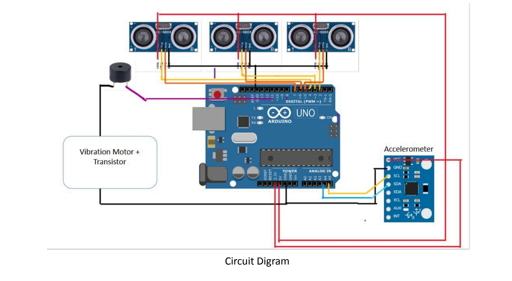

# 🔷 BlindMate – A Smart Blind Stick

> Final project for *Engineering Design (2024–25)* at IIT Jodhpur

**BlindMate** is an assistive walking stick designed to help visually impaired individuals navigate safely using real-time obstacle detection. It uses ultrasonic sensors, a buzzer, and vibration motors to provide both audio and haptic feedback.

---

## 👥 Team G3 – Batch A4

| Name                  | Roll Number  |
|-----------------------|--------------|
| Harsh Harish Chaudhari | B24CM1027    |
| Raghav Srinivasan      | B24EE1060    |
| Subhanshu Gupta        | B24CS1072    |
| Anuja Pawar            | B24MT1006    |
| Sahilpreet Singh       | B24ME1063    |
| Bhuneshwar Maholiya    | B24CH1014    |
| M. Pavan Naik          | B24BB1020    |
| Kondagadapu Mrudhula   | B24CI1022    |

---

## 🛠️ Features

- **🧠 Obstacle Detection** using two ultrasonic sensors (left & right)
- **🔊 Buzzer Alerts** for immediate obstacle warnings
- **📳 Vibration Feedback** for silent/tactile alerts
- **🔋 Low-power & Lightweight** design
- **💸 Cost-effective** solution for wide accessibility

---

## 🚶‍♂️ Intended Users

- People with **partial or complete blindness**
- **Elderly individuals** with limited vision
- **Rehabilitation centers** serving the visually impaired

---

## 💡 How It Works

- If an object is detected within 20 cm on either side of the stick:
  - The **buzzer** turns on.
  - Both **vibration motors** activate.
- If there's no nearby obstacle:
  - The system remains silent and idle.

---

## 🧪 Technologies Used

- **Arduino Uno**
- **Ultrasonic Sensors (HC-SR04)**
- **Piezo Buzzer**
- **Vibration Motors**
- **Optional**: Accelerometer for fall detection *(in testing phase)*

---

## 🧩 Future Improvements

- Add **accelerometer-based fall detection**
- Integrate **GPS** for outdoor tracking and location sharing
- Add **voice feedback** via speaker for advanced audio guidance

---

📹 Demo Video

---

##📹 Demo Video
🎥 [Click here to view the demo](https://www.youtube.com/shorts/TlrRZLMOZlE)

> 👆 Hosted on YouTube Shorts. Click to watch the working prototype in action!
